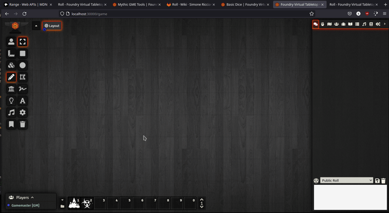
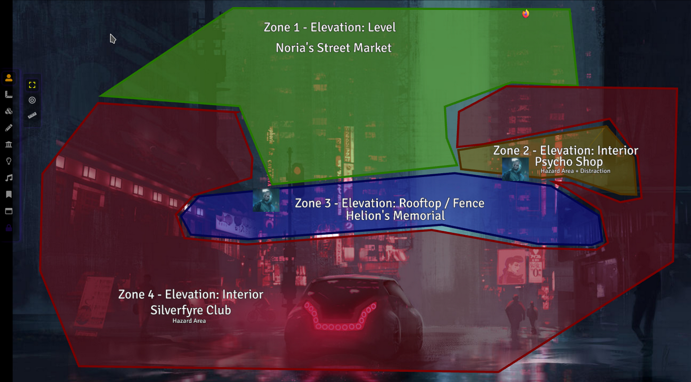

# Terrain Randomizer for FoundryVTT

Set of macros for playing
with [The Terrain Randomizer](https://www.drivethrurpg.com/product/359218/The-Terrain-Randomizer) in FoundryVTT

_Dynamically improvise interesting battle maps and situational maps for your RPG games with this procedural technique!
The Terrain Randomizer book injects tactical depth with minimal player effort._

This implementation relies on [Dice so Nice!](https://foundryvtt.com/packages/dice-so-nice) as a module dependency

[Invite me to a Coffee](#by-jeansenvaars) :) if you enjoy my work!

## Crimson Scholar Press

**The Terrain Randomizer** is REQUIRED to use and understand this content!

All attributions belong to [Crimson Scholar Press](https://www.drivethrurpg.com/browse/pub/19647/Crimson-Scholar-Press)
and this module is redistributed with _appropriate permission from author_ **José Manuel Navarro** - And may NOT be REDISTRIBUTED FURTHER without CONSENT

[Get The Terrain Randomizer in DriveThruRPG](https://www.drivethrurpg.com/product/359218/The-Terrain-Randomizer)

## Features

1. Fully automated Zone Generator using 3D dice that stay on screen until finished
   1. The logic of the book will be applied to procedurally generate Zones and characteristics
   2. Press "Finished" button to clear the dice from screen! (Expires automatically after 5 minutes)
   3. It does NOT include elevation calculation as those require your inputs and creativity
2. Decoration generator that produces detailed hazards, blocks and other challenges for your zones!
   1. Following Decoration creation, the Decorations Macro will produce Zone features automatically!
   2. It does NOT include detail tables as following the books guidelines to use your own instead!

**Recommendations:** 
1. Use Foundry's free-form drawing tools and text tools to take notes
2. Draw and proceed in the order zones as in the chat
3. Use solid fill colors and separated colors for zones
4. Use Dice So Nice! Settings as:
   1. Autoscale: off
   2. Scale: 30
   3. Force: weak
5. Use **Minimal UI** for getting more space on your screen and minimize the chat while drawing

## How to use

1. Install this module through the FoundryVTT Module Installer
2. Enable the module in your world
3. Open compendiums and drag The Terrain Randomizer macros into your hotbar! 

**CUSTOMIZATION** - Macros use RollTable by a strict name. Import the tables from the compendium and customize them, and will be automatically used, so long the names are not changed!

## To Do
* Further customization of probabilities
* Improve quality of life such as Dice so Nice temporary settings on the macro
* Figure a way of disabling camera panning when touching screen edges
* Figure a way of DIce so Nice to reduce the used size of canvas or fix dice location relative to the scene

## Author

This module is developed by me (Saif Ellafi - JeansenVaars) independently, and I hold no business relationship with Crimson Scholar Press or his author. I (Saif Ellafi / @JeansenVaars) was given PERMISSION by **José Manuel Navarro** to distribute this package UNDER STRICT
CONSENT of non-commercial distribution within Foundry VTT only and Power to revoke if so desired.

However you can still [Invite me to a Coffee](#by-jeansenvaars) :) if you enjoy my work!

### Contributors

Thanks to @JDW for his wonderful Dice so Nice! Module for 3D dice, which is required. Also do check [Foundry Hub](https://www.foundryvtt-hub.com) as its creator!
Thanks of course to José Manuel Navarro for the permission of publishing this module

### Community

Special thanks to the Community at the Discord Channel from [Mythic Game Master Emulator](https://discord.gg/hyHUuZEt) for the support

## By JeansenVaars

## Check out my other modules!

* [Mythic GME Tools](https://github.com/saif-ellafi/foundryvtt-mythic-gme)
* [Minimal UI](https://github.com/saif-ellafi/foundryvtt-minimal-ui)
* [Window Controls](https://github.com/saif-ellafi/foundryvtt-window-controls)
* [Scene Preview](https://github.com/saif-ellafi/foundryvtt-scene-preview)
* [Super Select](https://github.com/saif-ellafi/foundryvtt-super-select)

# License

[MIT License](./LICENSE.md)

# Powered By

Thanks to JetBrains I can work on this project using **WebStorm**.
